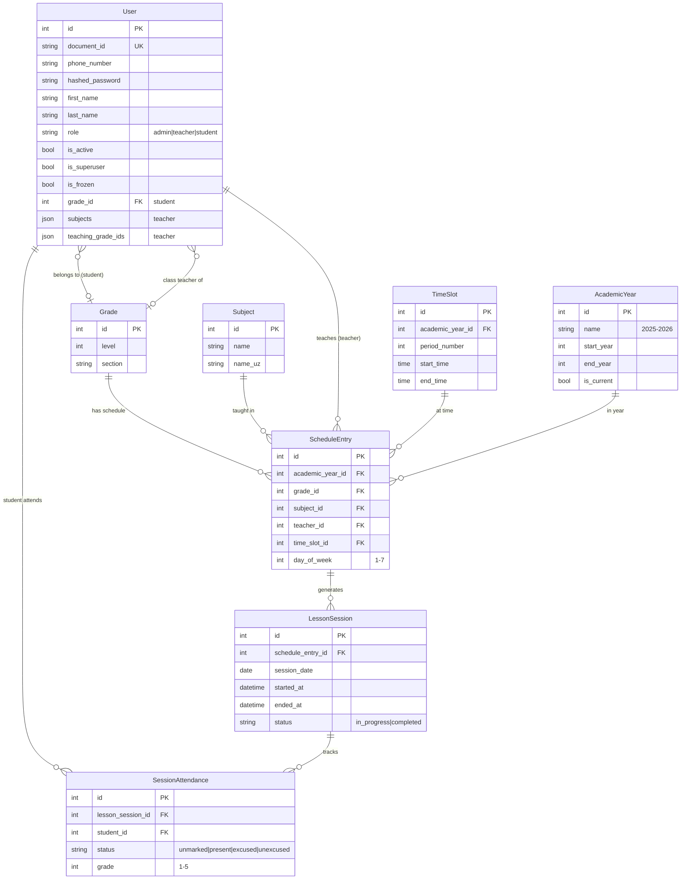
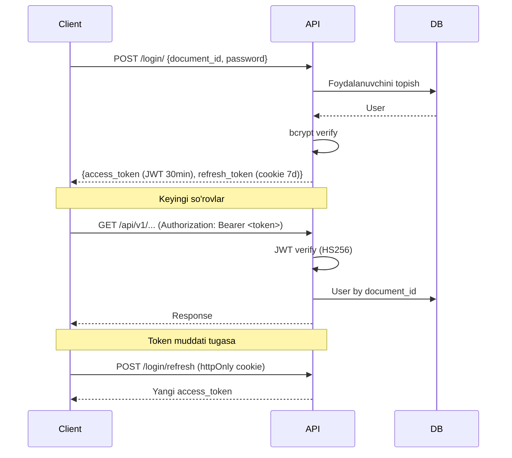
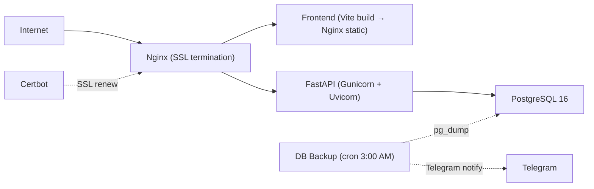

# 🎓 IMKON LMS — Loyiha Ko'rib Chiqish (Walkthrough)

**IMKON Liderlar Maktabi** uchun o'quv jarayonini boshqarish tizimi (Learning Management System).

---

## Texnologiyalar Steki

| Qatlam | Texnologiya |
|--------|------------|
| **Backend** | FastAPI + SQLAlchemy 2.0 (async) + PostgreSQL 16 + Alembic |
| **Frontend** | React 19 + TypeScript + TanStack Router/Query + Tailwind CSS 4 |
| **UI Kit** | Radix UI + shadcn/ui komponentlar |
| **Deploy** | Docker Compose + Nginx + Let's Encrypt SSL + GitHub Actions |
| **Package Manager** | `uv` (backend), `npm` (frontend) |
| **Linting** | Ruff (backend), Biome (frontend) |

---

## Loyiha Tuzilishi

```
imkon-lms/
├── backend/
│   ├── app/
│   │   ├── main.py              # FastAPI ilova entry point
│   │   ├── api/
│   │   │   ├── deps.py          # Dependency injection (auth, DB session)
│   │   │   └── routes/          # API endpointlar (13 ta modul)
│   │   ├── core/
│   │   │   ├── config.py        # Pydantic Settings (composited)
│   │   │   ├── db.py            # AsyncEngine + session factory
│   │   │   ├── security.py      # JWT + bcrypt
│   │   │   ├── setup.py         # Lifespan, CORS, auto-sync
│   │   │   ├── exceptions.py    # Custom HTTP exceptions
│   │   │   └── uploads.py       # Fayl yuklash yordamchisi
│   │   ├── crud/                # Database CRUD operatsiyalari
│   │   ├── models/              # SQLAlchemy ORM modellari (11 ta)
│   │   ├── schemas/             # Pydantic sxemalar
│   │   ├── commands/            # CLI buyruqlar
│   │   └── migrations/          # Alembic migratsiyalar
│   ├── Dockerfile
│   └── pyproject.toml           # Python 3.13
├── frontend/
│   ├── src/
│   │   ├── routes/              # TanStack file-based routing
│   │   │   ├── __root.tsx       # Root layout (devtools, error boundary)
│   │   │   ├── login.tsx        # Login sahifasi
│   │   │   ├── _layout.tsx      # Authenticated layout (sidebar)
│   │   │   └── _layout/         # Protected sahifalar
│   │   │       ├── index.tsx       # Dashboard
│   │   │       ├── students.tsx    # O'quvchilar boshqaruvi
│   │   │       ├── teachers.tsx    # O'qituvchilar
│   │   │       ├── timetable.tsx   # Dars jadvali
│   │   │       ├── lessons.tsx     # Darslar (boshlash, davomat)
│   │   │       └── attendance.tsx  # Davomat ko'rish (admin)
│   │   ├── components/
│   │   │   ├── ui/              # 26 ta shadcn/ui komponent
│   │   │   ├── Sidebar/         # App sidebar
│   │   │   ├── Students/        # Student-specific komponentlar
│   │   │   ├── Common/          # ErrorComponent, Footer, NotFound
│   │   │   └── timetable/       # Timetable komponentlar
│   │   ├── hooks/               # Custom React hooklar
│   │   ├── lib/                 # API client, utillar
│   │   └── config/              # Konfiguratsiya
│   ├── Dockerfile
│   └── package.json
├── docker-compose.yml           # Dev muhit (DB + API)
├── docker-compose.prod.yml      # Production (DB + API + Frontend + Nginx + Certbot + Backup)
├── nginx/                       # Nginx konfiguratsiyasi
├── scripts/                     # Deploy, backup, SSL skriptlari
└── Makefile                     # Qulay buyruqlar
```

---

## Ma'lumotlar Bazasi Modellari



> [!NOTE]
> Barcha modellar `BaseModel` dan meros oladi — `id`, `created_at`, `updated_at`, `is_deleted`, `deleted_at` maydonlari mavjud (soft-delete pattern).

---

## API Endpointlar

Barcha routelar `/api/v1` prefiksi ostida. `🔓` — autentifikatsiya talab qilinadi.

| Modul | Endpoint | Tavsif |
|-------|----------|--------|
| **Health** | `GET /health` | Tizim holati tekshiruvi |
| **Login** | `POST /login/` | Telefon/document_id + parol bilan kirish |
| | `POST /login/student` | O'quvchi parolsiz kirish (document_id) |
| | `POST /login/refresh` | Refresh token orqali yangilash |
| **Logout** | `POST /logout/` 🔓 | Chiqish |
| **Users** | `GET /users/me` 🔓 | Joriy foydalanuvchi |
| **Academic Years** | `GET /academic-years/current` 🔓 | Joriy o'quv yili |
| **Grades** | `GET /grades/` 🔓 | Sinflar ro'yxati |
| **Subjects** | `GET /subjects/` 🔓 | Fanlar ro'yxati |
| **Students** | `GET /students/` 🔓 | O'quvchilar (filter, search, pagination) |
| **Teachers** | `GET /teachers/` 🔓 | O'qituvchilar (search) |
| **Timetable** | `GET/PATCH /timetable/settings` 🔓 | Maktab sozlamalari |
| | `GET/POST/DELETE /timetable/time-slots` 🔓 | Dars vaqtlari |
| | `POST /timetable/time-slots/generate` 🔓 | Avtomatik generatsiya |
| | `CRUD /timetable/schedule` 🔓 | Dars jadvali boshqaruvi |
| **Lessons** | `GET /lessons/today` 🔓 | Bugungi darslar (o'qituvchi uchun) |
| | `POST /lessons/sessions` 🔓 | Dars boshlash |
| | `GET /lessons/sessions/{id}` 🔓 | Dars tafsilotlari |
| | `PATCH /lessons/sessions/{id}/attendance` 🔓 | Davomat belgilash |
| | `POST /lessons/sessions/{id}/end` 🔓 | Darsni tugatish |
| | `GET /lessons/attendance` 🔓 | Kunlik davomat (admin) |
| **Sync** | `POST /sync/` 🔓 | Payment tizimidan sinxronlash |

---

## Autentifikatsiya Tizimi



**Xususiyatlari:**
- JWT (HS256) — Access token (30 daqiqa) + Refresh token (7 kun, httpOnly cookie)
- Student login — parolsiz (faqat `document_id`), jismoniy tekshiruv bilan
- Timing-safe authentication — dummy hash orqali
- Auto token refresh — 401 da frontend interceptor avtomatik yangilaydi

---

## Sync Tizimi (Payment ↔ LMS)

Loyihada tashqi **Payment Management System** (`imkonschool.uz`) dan o'quvchilar, sinflar va o'quv yillari sinxronlashtirish tizimi mavjud:

- **Avtomatik sync** — har 15 daqiqada background task (`_auto_sync_loop`)
- **Manual sync** — admin tomonidan `POST /sync/` orqali
- `SyncLog` modelida har bir sinxronlash natijalari saqlanadi

---

## Frontend Sahifalar

| Sahifa | Fayl | Funksionallik |
|--------|------|---------------|
| **Login** | `login.tsx` | Admin/Teacher login (parol) yoki Student login (document_id) |
| **Dashboard** | `_layout/index.tsx` | Asosiy sahifa |
| **O'quvchilar** | `_layout/students.tsx` | Ro'yxat, qidiruv, filtrlash (sinf, holat), pagination |
| **O'qituvchilar** | `_layout/teachers.tsx` | Ro'yxat, qidiruv |
| **Dars jadvali** | `_layout/timetable.tsx` | Haftalik jadval, time slot boshqaruvi, schedule CRUD |
| **Darslar** | `_layout/lessons.tsx` | O'qituvchi uchun bugungi darslar, dars boshlash, davomat |
| **Davomat** | `_layout/attendance.tsx` | Admin uchun sinf bo'yicha kunlik davomat |

---

## Deploy Infratuzilmasi



**Production compose servislari:**
1. `db` — PostgreSQL 16 Alpine
2. `api` — FastAPI (gunicorn, 1 worker, prestart.sh → alembic upgrade)
3. `frontend` — Vite build → Nginx static serve
4. `nginx` — Reverse proxy + SSL
5. `certbot` — SSL sertifikat yangilash (12 soatda)
6. `db-backup` — Kunlik backup (3:00 AM) + Telegram xabarnoma

---

## Arxitektura Kuchli Tomonlari ✅

1. **Zamonaviy stack** — FastAPI async + React 19 + TanStack — yuqori performance
2. **Soft-delete pattern** — barcha modellarda `is_deleted` + `deleted_at`
3. **Generic CRUD** — `BaseCRUD[T]` orqali DRY operatsiyalar
4. **Composited Settings** — `pydantic-settings` orqali modularizatsiya qilingan config
5. **Auto-sync** — Payment tizimi bilan avtomatik sinxronlash
6. **Token refresh** — Seamless 401 handling frontend interceptor orqali
7. **DB backup + Telegram** — Production da avtomatik backup va xabarnoma
8. **Timing-safe auth** — Dummy hash orqali timing attack himoyasi
9. **File-based routing** — TanStack Router orqali intuitiv routing
10. **Conditional index** — `is_deleted = false` shartli unique indexlar

---

## Yaxshilash Takliflari 💡

| # | Taklif | Tafsilot |
|---|--------|----------|
| 1 | **Role-based access** | Hozirda faqat `is_superuser` tekshiriladi. `UserRole` enum (admin/teacher/student) asosida permission tizimi qo'shish kerak |
| 2 | **Test coverage** | `tests/` papka mavjud lekin testlar yo'q. Pytest + httpx bilan API testlar yozish kerak |
| 3 | **Rate limiting** | Login endpointlarga brute-force himoyasi qo'shish |
| 4 | **Pagination standartizatsiya** | Backend da `get_multi()` `total_count` qaytaradi, lekin frontend `count` kutadi — nomuvofiqlik |
| 5 | **WebSocket** | Real-time davomat yangilanishi uchun WebSocket qo'shish mumkin |
| 6 | **Caching** | Redis orqali tez-tez so'raladigan ma'lumotlarni (grades, subjects) keshlash |
| 7 | **Audit log** | Kim qachon nima o'zgartirganini kuzatish |
| 8 | **Student portal** | O'quvchilar uchun o'z davomati va baholarini ko'rish |
| 9 | **Migration rollback** | Production da `alembic downgrade` strategiyasi |
| 10 | **Monitoring** | Sentry yoki Prometheus + Grafana integratsiyasi |

---

> [!TIP]
> Loyiha ishga tushirish uchun: `make up` (DB), `make migrate`, `make run` (backend), `cd frontend && npm run dev` (frontend).
